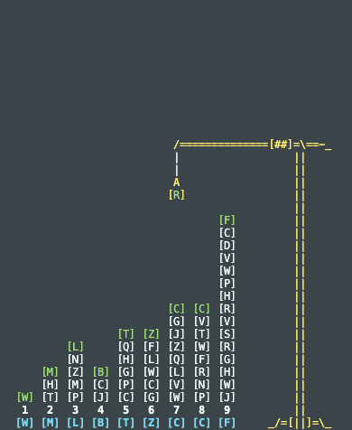

# advent-of-code-22

This repository contains my solutions to the [Advent of Code 2020](https://adventofcode.com/2020) challenges.

## Usage

Each day has its own folder, and each challenge has its own file. To run a challenge, use the following command:

```bash
$ python dayXX/main.py
```

To run the tests, use the following command:

```bash
$ pytest dayXX/main.py
```

## Visualizations

## Day 05



Inspired by [this](https://www.reddit.com/r/adventofcode/comments/zdszct/2022_day_5_1_small_terminal_python_animation_for/) Reddit post from [MrAntex](https://github.com/MrAntex/AoC-Day5p1-animated).

This utilizes the curses library to create a terminal visualization of the crane moving the crates.
